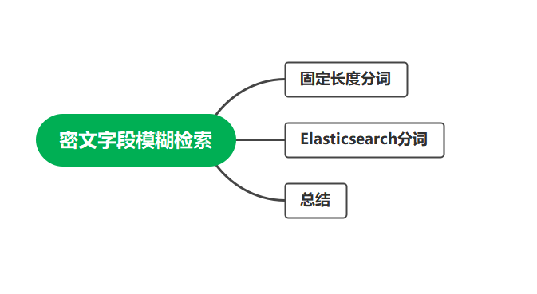
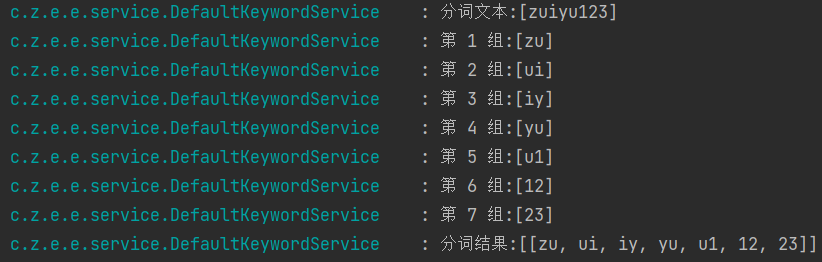
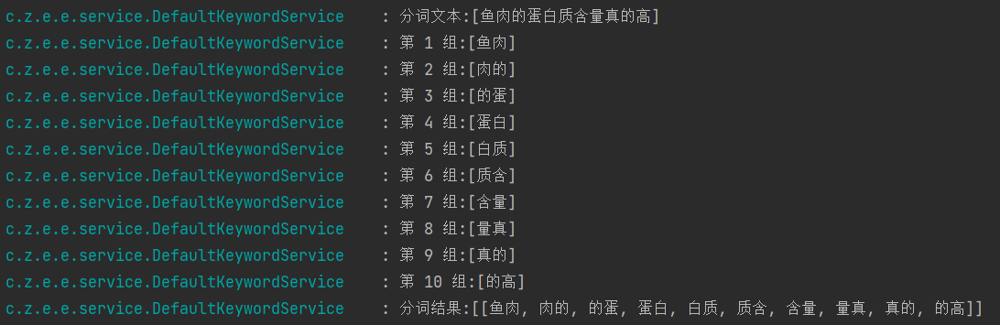
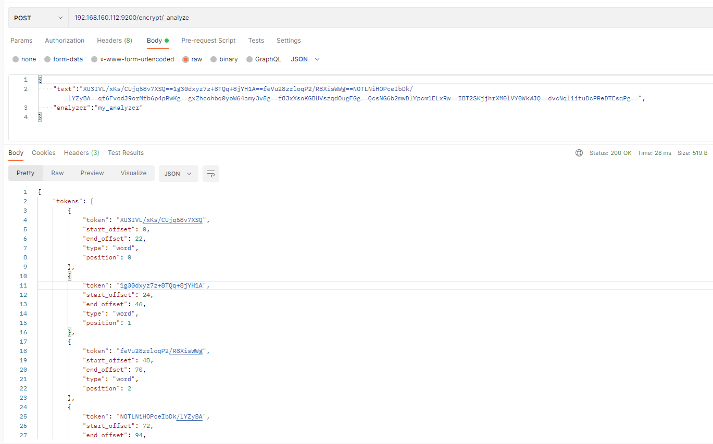
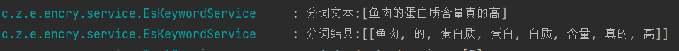

在个别的行业中，数据的安全问题是非常的重要的，所以需要数据库存储的数据是需要加密存储的。所以也就引申出来本文这个问题，加密之后的密文，还能模糊检索吗，如果能检查，如何做模糊检索呢？

现在的系统设计中，常见的加密字段有、密码、身份证号、手机号、住址信息、银行卡、信用卡以及个别行业的敏感信息。这些信息对加密的要求也不一样，对于密码来说，一般使用不可逆的加密算法就可以，一般不会用到检索。但是对于身份证号或者个别领域中的中文信息，我们是需要支持密文模糊匹配的，下面我们就来看看有哪些实现方式。



本来主要讲两种常规的简单加密做法，主要目标为能实现密文的模糊查询。下面来跟我看第一种。


# 常规分词加密

常规加密的密文检索功能根据`4位英文字符（半角）`，`2个中文字符（全角）`作为一个检索条件，将一个字段拆分为多个字段。

比如：`zuiyu123`

使用`4个字符`为一组的加密方式。

第一组` zuiy`，第二组`uiyu`，第三组`iyu1`，第四组`yu12`，第五组`u123`...如果字符串很长，依次类推下去。

如果需要检索所有包含检索条件 `uiyu` 的数据，加密字符后通过 `key like ‘%加密uiyu的密文%’`查询。

所以这种实现方式就会有一种问题就是，随着加密字符串的增加，密文也会变的越大，所以一般用此处方式需要注意数据库中的字段长度限制。


需要注意的是，使用此处方式有一定的限制：


1、支持模糊检索加密，但是加密的**密文随原文长度增长**。

2、支持的模糊检索条件必须**大于等于4个英文数字或者2个汉字**，不支持短的查询（自定义该局限性，业界常用的就是**4个英文数字或者2个汉字**，再短的长度不建议支持，因为分词组合会增多从而导致存储的成本增加，反而安全性降低。）。

3、返回的列表不是很精确，需要**二次筛选**，先解密在进一步筛选。


字符串拆分的代码如下：

```java
protected List<String> loopEncryptString(String input, int chunkSize) {
        int length = input.length();
        List<String> strList = new LinkedList<>();
        for (int i = 0; i < length; i++) {
            StringBuilder chunkBuilder = new StringBuilder();
            for (int j = 0; j < chunkSize; j++) {
                int index = (i + j) % length;
                chunkBuilder.append(input.charAt(index));
            }
            strList.add(chunkBuilder.toString());

            log.info("第 {} 组:[{}]",i+1,chunkBuilder);
            // 如果到了最后一个分组，则不再循环第一个字符
            if (i + chunkSize >= length) {
                break;
            }
        }
        log.info("分词结果:[{}]",strList);
        return strList;
    }
```

对于上述文本`zuiyu123`分词效果如下



下面来看下中文的分词效果：



检索一下，只要我们使用的是包含上述分词结果的条件我们就可以检索的到。

比如我们检索个`蛋白质`

```text
search result:[[{ID=8dac4d97-f05f-472e-94b2-02828aa235d6, CONTENT=ELYJBkZbfiVaJgTdlgglDg==UYwxxmEMQ9hq1jOax+r5rg==WwCBtglEf6clcWajP9sK+A==4sEGCqZ4P8Osr0dW84zFEA==c2AZejHeUp/5gpPkexfNcg==pvh/TcZRO4zwD+kwbE9lHw==1g30dxyz7z+8TQq+8jYH1A==AsWZOeiprypfrzSK3FtOuw==01vpoSuCXOpKCgcPsNlXyQ==79BPmIhSwMaA7hjN3ENDxA==}]]

```


除了上面这个方式外，发散一下思维，如果你用过 Elasticsearch 的话，会不会有点想法呢？

因为在中文的场景中，中文既然要分词，选择专业的分词器应该是更合理的啊，所以我们可以使用？？？


对的，你没猜错，既然是要分词，对于特殊的中文业务场景，直接使用 Elasticsearch 的分词器分词不就好了吗，然后再用 Elasticsearch 的强大检索能力，不就可以满足我们的模糊检索需求了吗，想到就去做，下面就跟着我一起来看下如果用 Elasticsearch 的分词实现密文模糊检索。


# 分词器分词检索

使用分词器分词进行密文检索的原理：

1、使用 Elasticsearch 自带的**正则分词器**对加密后的密文进行分词。

2、检索时使用 Elasticsearch 的`match`进行检索。

本文演示使用`AES`进行加解密，所以分词器我就直接使用正则匹配，将密文中的内容按照`==`进行拆分。

下面我们一起进入代码时间，跟随着我的脚本来看看分词密文检索是什么样的。

也欢迎你来实操体验一下，有什么问题欢迎评论区留言告诉我，也可以关注《醉鱼Java》，私信我。


* 创建一个使用`pattern`分词器的索引`encrypt`

  > 如下创建索引语句为 Elasticsearch **6.8** 的语句，如果使用 **7+、8+** 的需要修改为对应的版本。
  >
  > `mappings `中的 `_doc`

  ```text
  put 127.0.0.1:9200/encrypt
  {
      "settings": {
          "analysis": {
              "analyzer": {
                  "my_analyzer": {
                      "tokenizer": "my_tokenizer"
                  }
              },
              "tokenizer": {
                  "my_tokenizer": {
                      "type": "pattern",
                      "pattern": "=="
                  }
              }
          }
      },
      "mappings": {
          "_doc": {
              "properties": {
                  "content": {
                      "type": "text"
                  }
              }
          }
      }
  }
  ```

  

* 随便对于一个密文进行分词，可以看到，已经按照我们的语气进行`==`拆分为多个词语了

  


其实不难发现，我们使用 `AES` 加密，就是对分词之后的每个词语进行加密，然后组成一个新的字符串。

还是上面那句话`鱼肉的蛋白质含量真的高`，我们看一下分词结果。



所以我们按照`==`拆分之后，检索式再通过加密之后的密文进行检索，也就相当于分词检索了。

检索结果如下：

```text
search result:[{"hits":[{"_index":"encrypt","_type":"_doc","_source":{"content":"ELYJBkZbfiVaJgTdlgglDg==9hF4g5NErtZNS9qFJGYeZA==uH9W7jvdoLIKq5gOpFjhWg==4sEGCqZ4P8Osr0dW84zFEA==c2AZejHeUp/5gpPkexfNcg==1g30dxyz7z+8TQq+8jYH1A==01vpoSuCXOpKCgcPsNlXyQ==kIzJL/y/pnUbkZGjIkz4tw=="},"_id":"1713343285459","_score":2.8951092}],"total":1,"max_score":2.8951092}]
```


# 总结


密文的模糊查询就是以空间成本换取的。相比于存储原文，密文比原文增长了好几倍。


如果这篇文章对您有所帮助，或者有所启发的话，帮忙点个关注一下，您的支持是我坚持写作最大的动力。


求一键三连：点赞、转发、在看。


wx 搜索《醉鱼Java》，回复面试、获取2024面试资料